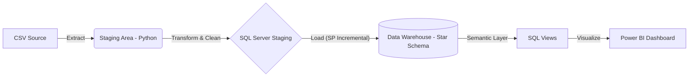

# 🛒 Retail Sales Data Warehouse (End-to-End)


Un proyecto de ingeniería de datos completo que implementa un Data Warehouse moderno para una empresa de Retail. El sistema ingesta datos transaccionales, los normaliza en un modelo **Estrella (Star Schema)** y presenta insights de negocio a través de un dashboard interactivo.

## 🏗️ Arquitectura del Sistema

El flujo de datos sigue una arquitectura ELT/ETL robusta diseñada para ser escalable e incremental.


Decisiones de Diseño 
Para garantizar escalabilidad y consistencia, se tomaron las siguientes decisiones arquitectónicas:

- Grano: Se eligió el nivel de detalle máximo (1 fila por línea de factura) para permitir análisis profundos de canasta de compra (Market Basket Analysis).

- SCD Tipo 1: Para Dimensiones (Cliente/Producto) se priorizó el estado actual sobre el histórico para simplificar el modelo inicial y optimizar el rendimiento de consulta.

- Estrategia de Staging: Separación estricta entre staging_raw (copia fiel del origen para auditoría) y staging_clean (datos tipados y validados) para desacoplar la extracción de la transformación.

- Carga Incrementa: El ETL no reprocesa todo el historial. Utiliza una marca de agua basada en InvoiceDate para procesar solo registros nuevos.

- Manejo de Devoluciones: Las transacciones con InvoiceNo comenzando en 'C' se segregan lógicamente para analizar "Ventas Brutas" vs "Netas" sin ensuciar los KPIs operativos principales.

Modelo de Datos (Esquema Estrella)
El Data Warehouse centraliza los hechos en FactSales rodeado de dimensiones conformadas.

```text
erDiagram
    FactSales {
        int fact_sales_key PK
        int date_key FK
        int product_key FK
        int customer_key FK
        decimal line_total
    }
    DimDate ||--o{ FactSales : "filtra por"
    DimProduct ||--o{ FactSales : "describe"
    DimCustomer ||--o{ FactSales : "compra"
    DimCountry ||--o{ FactSales : "localiza"
```
  

Reglas de Calidad de Datos
El pipeline de Python (clean_staging.py) aplica filtros estrictos antes de la carga:

- Integridad de Precios: UnitPrice > 0 (Se eliminan errores de sistema o regalos no contables).

- Manejo de Nulos: CustomerID nulo se mapea a -1 (Unknown) para mantener integridad referencial en el modelo estrella.

- Consistencia: Se eliminan duplicados exactos a nivel de línea.

- Normalización: Descripciones vacías se imputan como "No Description".

Control y Monitoreo del ETL:
- El sistema mantiene un estado de ejecución en la tabla etl.control_table.

- Last Processed Date: Se almacena la fecha máxima de la última carga exitosa.

- Idempotencia: El Stored Procedure utiliza lógica MERGE y verificaciones de existencia para permitir re-ejecuciones seguras sin duplicar datos.

Componentes Clave
1. Ingesta & Limpieza (Python): Scripts modulares (pandas, sqlalchemy) que normalizan esquemas y aplican reglas de calidad (eliminación de devoluciones, manejo de nulos).

2. Staging Area (SQL): Tablas intermedias (raw y clean) para desacoplar la extracción de la carga.

3. Data Warehouse (SQL Server):

- Carga Incremental: Stored Procedure inteligente que gestiona Upserts (SCD Tipo 1) y marcas de agua (Watermarks) para cargar solo datos nuevos.

4. Analytics: Vistas SQL materializadas para métricas pre-calculadas y Dashboard en Power BI con medidas DAX.

```text
retail_data_warehouse/
├── 00_documentacion/      # Diagramas ERD, reglas de negocio y decisiones de diseño
├── 01_staging_area/       # Scripts Python para Ingesta y SQL para tablas temporales
├── 02_data_warehouse/     # DDLs del DW, Stored Procedures y Orquestador ETL
├── 03_analytical_layer/   # Vistas SQL para consumo de BI
├── 04_bi_powerbi/         # Archivo .pbix y guías de visualización
├── 05_utilities/          # Herramientas (Generador de DimDate, Reset)
└── requirements.txt       # Dependencias
```

🚀 Instrucciones de Ejecución
```text
Prerrequisitos
Python 3.9+

SQL Server (Developer/Express)

Power BI Desktop

Paso 1: Configuración
Clonar el repositorio:

Bash

git clone [https://github.com/TU_USUARIO/retail_data_warehouse.git](https://github.com/TU_USUARIO/retail_data_warehouse.git)
cd retail_data_warehouse
Crear entorno virtual e instalar dependencias:

Bash

python -m venv venv
source venv/bin/activate # Windows: venv\Scripts\activate
pip install -r requirements.txt
Configurar variables de entorno:

Renombrar .env.example a .env.

Editar .env con tus credenciales de SQL Server (DB_SERVER, DB_USER, etc.).

Paso 2: Base de Datos
Ejecutar los scripts SQL en SSMS en el siguiente orden estricto:

02_data_warehouse/sql/01_create_dw_database.sql

01_staging_area/sql/01_create_staging.sql

02_data_warehouse/sql/02_create_dimensions.sql

02_data_warehouse/sql/03_create_fact_table.sql

02_data_warehouse/sql/05_load_dimensions.sql (Carga miembros 'Unknown')

02_data_warehouse/sql/06_load_fact_incremental.sql (Stored Procedure)

Paso 3: Carga de Datos (ETL)
Colocar el dataset retail_cleans.csv en 01_staging_area/raw/.

Generar la Dimensión de Tiempo:

Bash

python 05_utilities/generate_dim_date.py
Ejecutar el Pipeline Maestro:

Bash

python 02_data_warehouse/python/etl_incremental.py
Este script orquesta la extracción, limpieza y carga incremental.
```

📊 Dashboard Overview
El reporte incluye:

KPIs Ejecutivos: Revenue, AOV, Total Orders.
Análisis Temporal: Tendencias de venta mensual/anual.
Top Products: Ranking de productos por ingresos (Pareto).
Geo-Spatial: Mapa de distribución de ventas por país.


Futuras mejoras
- Implementar SCD Tipo 2 en DimCustomer para trackear cambios históricos de ubicación.

- Orquestar el pipeline con Apache Airflow o Prefect.

- Contenerizar la base de datos con Docker.

- Agregar pruebas unitarias con pytest para las transformaciones de Pandas.

Desarrollado por Kevin ALajarin - 2025
